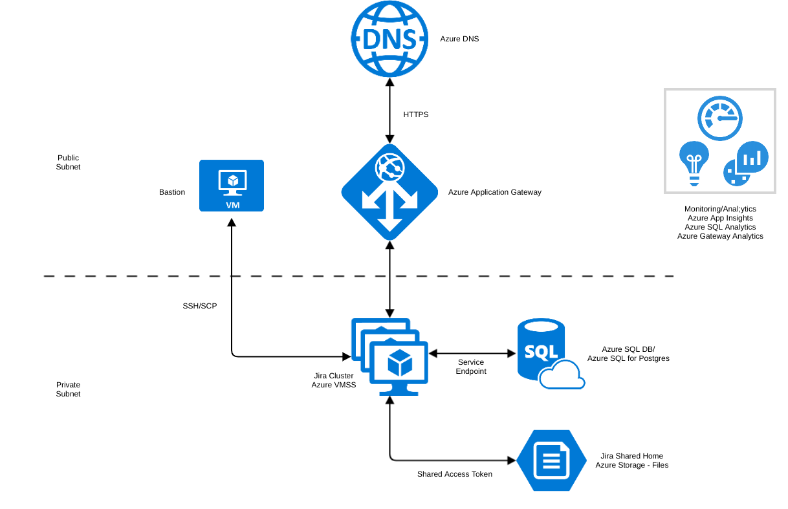

# Atlassian Data Center Azure Templates

## Note
Please note that these templates are for evaluation or 'proof of concept' deployments. These are not currently recommended for a production deployment 'as is' and will require adjustment to meet your needs.

## Purpose
This repository contains Azure ARM templates to install the following [Atlassian Data Center](https://www.atlassian.com/enterprise/data-center) products:  

1. [BitBucket Data Center](https://www.atlassian.com/software/bitbucket/enterprise/data-center)  
2. [Confluence Data Center](https://www.atlassian.com/software/confluence/enterprise/data-center)  
3. [Jira Software Data Center](https://www.atlassian.com/enterprise/data-center/jira)  
4. [Jira Service Desk Data Center](https://www.atlassian.com/software/jira/service-desk/enterprise/data-center)  

## Key Features
These templates will be utilise Azure Cloud features to create a resilient and scaleable solution:  

*  Only Azure "managed" features/functionality used to provide scaleablity, monitoring and backup/recovery features "out of the box."  
*  Secure solution - security and accessibility principles/rules applied to ensure all customer data is protected.  
*  Optional SSL and CNAME/domain name support.  
*  Advanced monitoring with integrated Azure Application Insights, Azure Monitor.  
*  Advanced analytics with integrated Azure Application Insights, Azure SQL Analytics, Azure Gateway Analytics.  
*  Log collection/aggregation.  
*  Choice of Azure SQL DB or Postgres databases.  
*  Choice of supplying existing Azure SQL DB or Postgres database.  
*  Integrated Azure Accelerated Networking for enhanced cluster performance.  
*  Recommended HW/cluster sizing or fully configurable HW options.  

 


Further information on the Atlassian Azure solution, features, install options, FAQs etc can be found at our [Support Page](https://hello.atlassian.net/wiki/spaces/DC/pages/369608838/Azure+Support+Page)  


## Installation
Each Atlassian application folder contains specific instructions on how to deploy the individual application so always check there first. As well as this repository, the Atlassian apps can also be found on the Azure Marketplace.

### Jumpbox SSH Key Parameter
However, for all apps, you'll always need to specify a `jumpboxSshKey` parameter in order to be able to connect (via SSH) to the jumpbox/bastion node (and then onto the Cluster nodes). This key is your device's SSH public key (normally found at `~/.ssh/id_rsa.pub`). Cut/paste this value into the `jumpboxSshKey` parameter like so:
```
    {
        "parameters": {
            "jumpboxSshKey":
                "value": "ssh-rsa AAAAo2D7KUiFoodDCJ4VhimXqG..."
            }
        }
    }
```

## Development
Please see the [DEVELOPING.md](DEVELOPING.md) for more information on how you can use the update/develop the templates.
